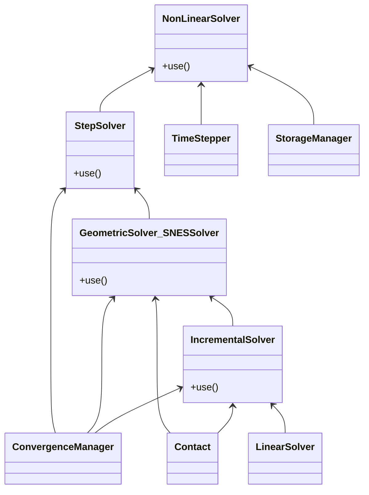

# Refonte NonLinearSolver

## Objectif

Actuellement, par exemple, dans l'`ops`, on crée un `NonLinearSolver` et un
`LinearSolver` que l'on transmet en cascade jusqu'au moment où on l'utilise
vraiment. Quand l'objet est créé tout en haut, cette cascade est indispensable mais
c'est très visible, répétitif, y compris aux endroits où on ne s'en sert pas.

Inversement, si on veut adapter l'`IncrementalSolver`, il faut aller modifier
`GeometricSolver` ou `SNESSolver`.

Pour définir un opérateur à façon, l'idée est que le développeur/utilisateur avancé
écrive son "`ops`" et y définisse les briques à utiliser.

Pour cela, il faut être capable de définir les objets très haut, bien avant
leur utilisation.

## Implémentation

L'idée est de remplacer la vingtaine de méthodes `setXxx()` différentes par une
seule méthode `use()` à laquelle on passe différentes *fonctionnalités*.

Le `NonLinearSolver` est une `SolverFeature` qui utilise des fonctionnalités
implémentée par d'autres `SolverFeature`-s.

Une *fonctionnalité* fait le travail si elle a la bonne interface et si
*elle*/*on* affirme qu'elle fournit le service demandé.

Les fonctionnalités fournies sont identifiées par un *entier codé* composé des
"options" disponibles (utilisation d'opérations bit à bit).
Elles sont définies dans `SolverOptions` (manipulées sous le nom abbrégé `SOP`).

Ainsi, si l'utilisateur veut tester son propre *solveur incrémental*, il peut
**utiliser** n'importe quel objet pourvu qu'il fournisse les méthodes
nécessaires et qu'il soit reconnu comme fournissant la **fonctionnalité**
`IncrementalSolver` (== programmation par interface).

Il suffit ensuite de dire au `StepSolver` d'**utiliser** tel `XxxSolver`, à
ce `XxxSolver` d'**utiliser** tel `IncrementalSolver`, à ce `IncrementalSolver`
d'**utiliser** tel `LinearSolver`...

Quand un objet a besoin d'une fonctionnalité, il récupère l'objet qui sait le
faire avec `get_feature` si on en attend un et un seul (éventuellement optionnel)
ou `get_features` si plusieurs peuvent y répondre.
Utiliser un entier codé pour `provide` permet de sélectionner un objet qui
fournit plusieurs fonctionnalités (exemples d'utilisation avec les options
`ForStep` et `ForIncr`).
On peut ajouter une propriété pour avoir un raccourci vers les fonctionnalités
souvent appelées (déjà fournies: `phys_pb` et `phys_state`).

## Détails

Les objets C++ n'héritent pas de `BaseFeature`.
L'attribut `provide` est ajouté par l'`injector` dans `PhysicalProblem` et `LinearSolver`.

Une spécialisation de `BaseFeature` a des attributs `required_features` et
`optional_features` (en plus de `provide`), à des fins de vérification.
`use()` vérifie que la fonctionnalité à enregistrer est supportée (requise ou
optionnelle).
La méthode `check_features` s'assure que les fonctionnalités requises
ont bien été fournies (par `use()`).
Un décorateur `BaseFeature.check_once` permet de faire cette vérification
avant qu'une méthode de calcul ne soit utilisée pour la première fois.



## Déclinaison pour meca_non_line

`NonLinearSolver` est l'objet qui réalise `MECA_NON_LINE`.

On ajoute un objet de plus haut niveau, `ProblemSolver`, sur lequel on construit
`MECA_NON_LINE` (cf. `meca_non_line_ops.py`).

Il est créé à partir d'un type d'opérateur et de l'objet produit :

```py
solver = ProblemSolver(NonLinearSolver(), NonLinearResult())
```

Il lui faut la définition du système étudié :

```py
phys_pb = PhysicalProblem(args["MODELE"], args["CHAM_MATER"], args["CARA_ELEM"])
solver.use(phys_pb)
```

Pour ce qui n'est pas encore une `Feature` :

```py
param = dict(
    COMPORTEMENT=args["COMPORTEMENT"],
    CONVERGENCE=args["CONVERGENCE"],
    NEWTON=args["NEWTON"],
    ETAT_INIT=args["ETAT_INIT"],
    INCREMENT=args["INCREMENT"],
    INFO=args["INFO"],
    CONTACT=args["CONTACT"],
    METHODE=args["METHODE"],
    SOLVEUR=args["SOLVEUR"],
)
solver.setKeywords(**param)
```

**Remarque** : `setKeywords()` existe pour l'interface publique, en interne,
les mots-clés sont une `Feature` particulière : `self.use(args, SOP.Keywords)`.
On pourrait ajouter l'attribut `provide = SOP.Keywords` à `_F`...

Définition du *TimeStepper* (objet requis):

```py
timeStepper = TimeStepper(list_inst)
...
solver.use(timeStepper)
```

Les objets gérant les différentes étapes peuvent être définis ici et utilisés :

```py
linear_solver = LinearSolver.factory("STAT_NON_LINE", args["SOLVEUR"])
solver.use(linear_solver)

step = StepSolver()
solver.use(step)
```

Puis, exécution avec  :

```py
solver.run()
```

`run()` appelle `initialize()` qui transmet les objets définis à l'opérateur
de résolution (ici un `NonLinearSolver`) en initialisant si besoin les objets
non définis, et ceci récursivement.

Le point intéressant est qu'une `Feature` peut dire ce qui lui manque.
Par exemple, si un objet faisant `IncrementalSolver` a été fourni, on l'utilise.
Sinon on en crée un par défaut.
Puis, qu'il ait été fourni ou pas, on parcourt les `Feature`-s dont il a besoin
et qui ne sont pas définies.
Parmi lesquelles, `LinearSolver` qui peut être lui-même soit fourni, soit créé
(à partir des mots-clés), etc.

## Application dans zzzz506*

- zzzz506a : utilisation d'un StepSolver utilisateur

  ```py
  class CustomStepSolver(StepSolver):
      """Example of custom object: just add a print.

      Whatever type of inherited from BaseFeature object can be used (not necessarly
      StepSolver inherited).
      It must provide the StepSolver feature and must have the expected interface.
      """

      def solve(self):
          """Solve the step."""
          try:
              super().solve()
          except code_aster.ConvergenceError as exc:
              print(f"+++ CustomStepSolver raises ConvergenceError: {exc}")
              raise
          else:
              print(
                  "+++ CustomStepSolver ends successfully, time:",
                  self.phys_state.time + self.phys_state.time_step,
              )

  snl = ProblemSolver(NonLinearSolver(), NonLinearResult())
  snl.use(PhysicalProblem(model, mater))
  snl.use(LinearSolver.factory(METHODE="MUMPS"))
  snl.phys_pb.addLoad(...)
  snl.setKeywords(
      CONVERGENCE={"RESI_GLOB_MAXI": 1.0e-6, "ITER_GLOB_MAXI": 20},
      NEWTON={"PREDICTION": "ELASTIQUE"},
      COMPORTEMENT={"RELATION": "VMIS_ISOT_LINE"},
  )
  snl.use(CustomStepSolver())
  snl.use(TimeStepper([0.5, 1.0]))
  snl.run()
  ```

- zzzz506c : utilisation d'un ConvergenceCriteria utilisateur (objet qui évalue
  un critère pour la convergence d'un pas de temps)

  ```py
  class CustomConvergenceCriteria(GeometricSolver):
      """Example of custom object: just add a print.

      Whatever type of inherited from BaseFeature object can be used (not necessarly
      GeometricSolver inherited).
      It must provide the GeometricSolver feature and must have the expected interface.
      """

      def solve(self, current_matrix):
          """Evaluate the convergence criteria"""
          try:
              result = super().solve(current_matrix)
          except code_aster.ConvergenceError as exc:
              print(f"+++ CustomConvergenceCriteria raises ConvergenceError: {exc}")
              raise
          else:
              nbiter = self.current_incr - 1
              print(f"+++ CustomConvergenceCriteria succeeds after {nbiter} iterations")
          return result


  snl = ProblemSolver(NonLinearSolver(), NonLinearResult())
  snl.use(PhysicalProblem(model, mater))
  snl.use(LinearSolver.factory(METHODE="MUMPS", RENUM="METIS", NPREC=8))
  snl.phys_pb.addLoadFromDict({"CHARGE": encast, "FONC_MULT": RAMPE})
  snl.phys_pb.addLoadFromDict({"CHARGE": depl, "FONC_MULT": RAMPE})
  snl.setKeywords(
      METHODE="NEWTON",
      CONVERGENCE={"RESI_GLOB_MAXI": 1.0e-8, "ITER_GLOB_MAXI": 20},
      NEWTON={"PREDICTION": "ELASTIQUE"},
      COMPORTEMENT={"RELATION": "VMIS_ISOT_LINE"},
      INFO=1,
  )
  snl.use(CustomConvergenceCriteria())
  snl.use(TimeStepper([0.5, 1.0]))
  snl.run()
  ```

## Version préliminaire

Dans cette version restituée, `ProblemSolver` n'est pas du tout générique.
Par exemple, on attend un ensemble de mots-clés propres à `MECA_NON_LINE`
qu'on ne retrouve pas forcément dans les autres opérateurs visés.
De même, les objets créés par défaut sont très typés mécanique et leur interface
est restée telle qu'elle était initialement.

Il devrait à terme permettre d'écrire les autres opérateurs en dynamique, en thermique...
Voir à cette occasion, si on doit remonter la création des objets utilisés par
défaut d'un niveau, et définir une interface générique, indépendante de la
physique, pour les différents objets.
