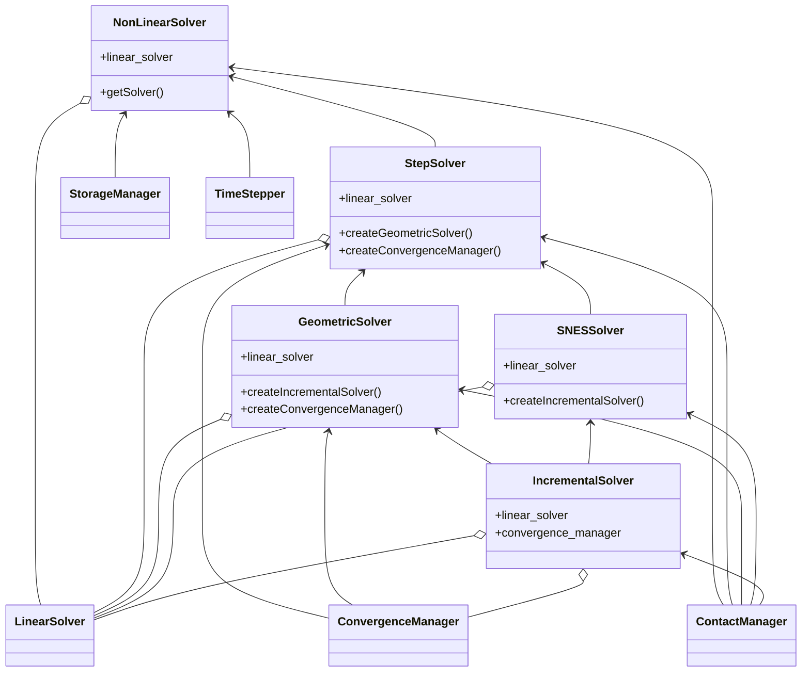
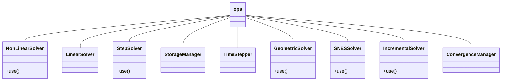
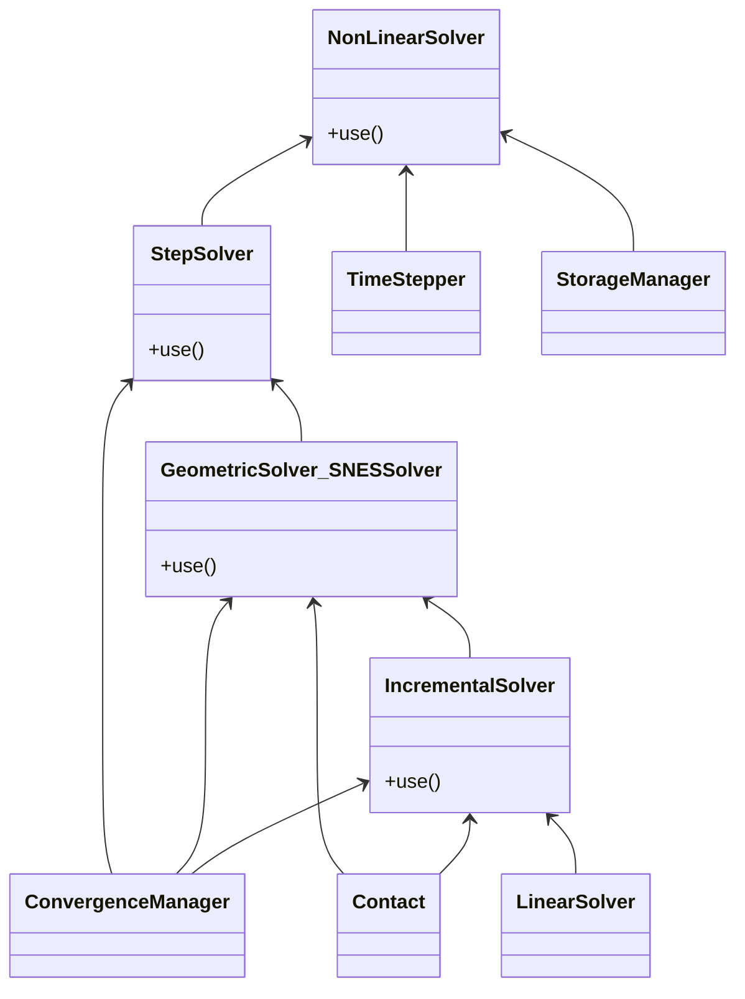

# Refonte NonLinearSolver

## Objectif

Actuellement, par exemple, dans l'`ops`, on crée un `NonLinearSolver` et un
`LinearSolver` que l'on transmet en cascade jusqu'au moment où on l'utilise
vraiment. Quand l'objet est créé tout en haut, cette cascade est indispensable mais
c'est très visible, répétitif, y compris aux endroits où on ne s'en sert pas.

Inversement, si on veut adapter l'`IncrementalSolver`, il faut aller modifier
`GeometricSolver` ou `SNESSolver`.

Pour définir un opérateur à façon, l'idée est que le développeur/utilisateur avancé
écrive son "`ops`" et y définisse les briques à utiliser.

Pour cela, il faut être capable de définir les objets très haut, bien avant
leur utilisation.

## Implémentation

L'idée est de remplacer la vingtaine de méthodes `setXxxx()` différentes par une
seule méthode `use()` à laquelle on passe différentes *fonctionnalités*.

Le `NonLinearSolver` est une `NonLinearFeature` qui utilise des fonctionnalités
implémentée par d'autres `XxxFeature`-s.

Une *fonctionnalité* fait le travail si elle a la bonne interface et si
*elle*/*on* affirme qu'elle fournit le service demandé.

Les fonctionnalités fournies sont identifiées par un *entier codé* composé des options
disponibles (utilisation d'opérations bit à bit).

Ainsi, si l'utilisateur veut tester son propre *solveur incrémental*, il peut
**utiliser** n'importe quel objet pourvu qu'il fournisse les méthodes
nécessaires et qu'il soit reconnu comme fournissant la **fonctionnalité**
`IncrementalSolver` (== programmation par interface).

Il suffit ensuite de dire au `StepSolver` d'**utiliser** tel `XxxxSolver`, à
ce `XxxxSolver` d'**utiliser** tel `IncrementalSolver`, à ce `IncrementalSolver`
d'**utiliser** tel `LinearSolver`...

Quand un objet a besoin d'une fonctionnalité, il récupère l'objet qui sait le
faire avec `get_feature` si on en attend un et un seul (éventuellement optionnel)
ou `get_features` si plusieurs peuvent y répondre.
Utiliser un entier codé pour `provide` permet de sélectionner un objet qui
fournit plusieurs fonctionnalités.
On peut ajouter une propriété pour avoir un raccourci vers les fonctionnalités
souvent appelées (déjà fournies: `phys_pb` et `phys_state`).

## Détails

Les objets C++ n'héritent pas de `BaseFeature`.
L'attribut `provide` est ajouté par l'`injector` dans `PhysicalProblem` et `LinearSolver`.

Une spécialisation de `BaseFeature` a des attributs `required_features` et
`optional_features` (en plus de `provide`), à des fins de vérification.
`use()` vérifie que la fonctionnalité à enregistrer est supportée (requise ou
optionnelle).
La méthode `check_features` s'assure que les fonctionnalités requises
ont bien été fournies (par `use()`).
Un décorateur `BaseFeature.check_once` permet de faire cette vérification
avant qu'une méthode de calcul ne soit utilisée pour la première fois.

## Commentaires

- `PhysicalState` : est-ce une `Feature` ? Ou une nouvelle instance à chaque pas ?

- `StepSolver` créé dans `NonLinearSolver` : `NonLinearSolver` devrait utiliser
une `StepSolver` *factory* pour en créer un à chaque pas en fonction de choix
définis précédemment.

  --> fait, instance unique.

- Le `StepSolver` utilise un `ConvergenceCriteria` pour valider un pas de temps
(à revoir, reprendre la structure de MEF++, une pile de critères à vérifier).

  Pile gérée par l'objet `ConvergenceManager` ?

- Au lieu d'une *factory* pour créer un nouvel objet à chaque pas/itération,
réutiliser l'objet (méthode `initialize()`).

  --> fait pour les `ConvergenceCriteria`

- `ConvergenceManager` de `StepSolver` à remonter tout en haut,
différent dans `GeometricSolver`, nécessaire ?

  --> Oui, je pense. En revanche, on prend le même objet pour
  `GeometricalSolver` et `IncrementalSolver`...

- Vérifier que les `use()` sont bien utilisés !

- Méthode pour transmettre tous les objets d'une `Feature` à une autre pour ne
pas répéter les `use()`.

- `zzzz506a,b,c` : Si on veut simplifier la création d'un `NonLinearSolver`,
il faut créer des objets par défaut pour `PhysicalState`, `Storage`,
éventuellement `StepSolver`.
Il faut alors faire attention à la cohérence : par exemple, utiliser le même
`PhysicalState`.

## Design final

